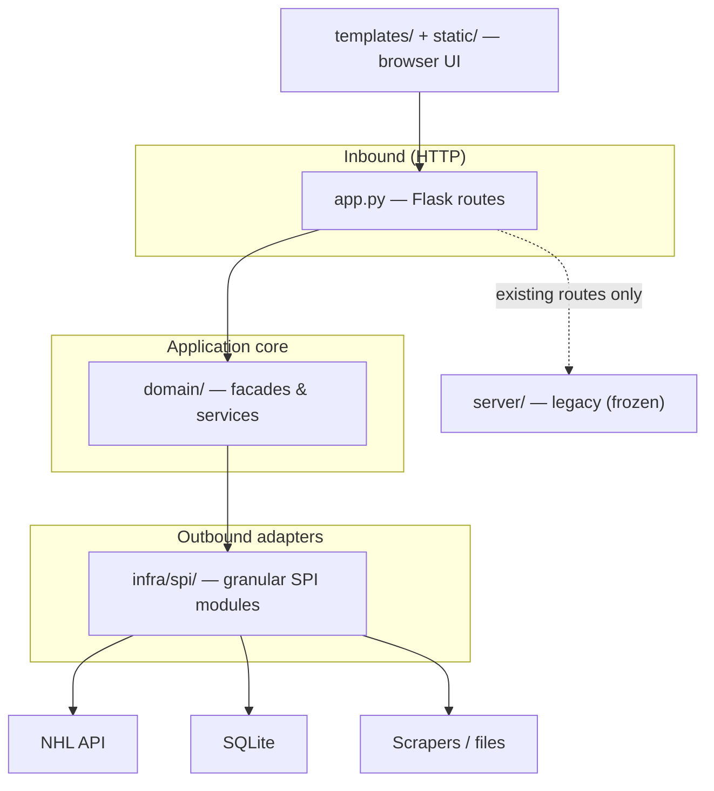

# AGENT.md

Guide for AI agents working on this repository. Read this before making non-trivial changes.

## What this project is

A **Python monolith** for tracking NHL hockey stats, calculating fantasy points, and ranking players to support fantasy drafting and roster decisions. Players are scored from raw stats (goals, assists, shots, PP points, hits, blocks, +/-) using configurable weights, then surfaced through ranked lists, filters, and watchlists/draftboards.

**Stack**

| Layer | Technology |
|-------|------------|
| Backend | Python **Flask** (`app.py`, `wsgi.py`), local **SQLite** (`identifier.sqlite`) |
| Frontend | **HTML**, **JavaScript**, **CSS**, **Bootstrap 4.5**, **jQuery** — no build step, no SPA framework |
| Data jobs | Standalone scripts under `script/` (scrapers, fantasy prep) |

Templates live in `templates/`; static assets in `static/`. Flask serves server-rendered pages and JSON APIs (e.g. `/api/nhl/fantasy`, `/api/nhl/fantasyV2`).

## Architecture — hexagonal (ports & adapters)

This codebase follows **hexagonal architecture**. Treat that as the source of truth for where code belongs and how dependencies flow.

**Dependency rule:** `domain/` must not import Flask, `app.py`, or `server/`. Domain code orchestrates use cases and may depend on `infra/spi/` adapters (and small shared helpers like `helper/`). `app.py` is the **composition root**: it wires HTTP to domain facades/services and returns JSON or rendered templates.

### `domain/` — facades for the UI

**Always implement business logic in `domain/` first.** Start with a facade or service class that **aggregates ports** (SPI adapters from `infra/spi/`) and **exposes domain-specific dataclasses** — not raw API/DB shapes. Wire HTTP in `app.py` only after that type exists.

The domain layer exposes **facades and services** that `app.py` calls. These types shape what the frontend receives (aggregated player stats, fantasy lists, gamelogs, grades, etc.) without knowing about HTTP or SQLite details.

Current modules (grow by feature, not by copy-pasting legacy `server/` patterns):

| Path | Role |
|------|------|
| `domain/fantasyplayer/` | Fantasy player queries and models |
| `domain/fantasygrade/` | Forward/defense grading; `fantasy_grader_facade.py` |
| `domain/gamelog/` | Player game logs |
| `domain/playerstat/` | Combined NHL skater stats; `nhl_player_stat_facade.py` |
| `domain/playerstatpercentile/` | Percentile calculations |
| `domain/nhlteam/` | Team-related domain (when used) |

**New features:** add or extend a facade/service under `domain/`, then register a route or API handler in `app.py` that calls it. Prefer facades when a use case composes multiple SPI calls (see `domain/playerstat/nhl_player_stat_facade.py`).

### `infra/spi/` — many small outbound adapters

**SPI** (service provider interface) adapters live under `infra/spi/`. Keep them **granular**: one adapter (or small folder) per external concern — a single NHL endpoint family, one repository table, one scrape source, etc. Do not fold unrelated I/O into one large “god” adapter.

| Path | Role |
|------|------|
| `infra/spi/nhlapi/` | Public NHL API (gamelog, team, roster; `nhlskater/` for summary, realtime, TOI) |
| `infra/spi/sqlite/` | SQLite repositories and row models (`fantasyplayer/`, `playerstat/`, `playerstatpercentile/`) |
| `infra/spi/hockeyreference/` | Hockey Reference scrape adapters |
| `infra/rest/` | Optional inbound REST adapters (sparse today; most HTTP stays in `app.py`) |

Domain services inject or construct SPI types as needed. Repositories map DB/API DTOs; domain holds business rules and composition.

### `server/` — legacy (do not modify)

`server/` is the **legacy** layer from an older facade + service + repository layout (`admin/`, `commons/`, `internaldata/`, `mockdraft/`, `nhlapi/`, `twitterapi/`). It remains wired in `app.py` for some routes until migrated.

**Policy for agents:**

- **Do not modify any file under `server/`.** No edits, refactors, or “small fixes” there unless the user **explicitly** asks to change legacy code.
- **Do not read or search `server/` by default** when implementing new behavior — use `domain/` + `infra/spi/` instead. Only open `server/` when the user names it or you must understand an existing route you are not allowed to change yet.
- **Do not add new dependencies on `server/`** from new domain or infra code. New work migrates *away* from `server/`, not deeper into it.

`app.py` may still import legacy facades for backward compatibility; over time, routes should switch to `domain/` entry points only.

### Other backend paths

- `helper/` — cross-cutting utilities (e.g. `http_helper.py`).
- `setting.py` — configuration (API keys, etc.).
- `script/` — offline scrapers and data prep (not on the request hot path).

## Frontend

- `templates/` — Jinja2. `index.html` is the shell; feature pages in subfolders:
  - `templates/fantasy/` — fantasy table, scoring, filters, weights
  - `templates/nhl/` — player, team, stat, lineup pages
  - `templates/draftcenter/`, `draftsimulator/`, `prospectlist/`, `prospectpage/`, `news/`
  - `nav.html`, `logo.html`, `logoname.html` — chrome
- `static/` — `cookiehandler.js`, `fantasycookiehandler.js`, `chartjshandler.js`, `envvariables.js`, `styles/`

**Conventions**

- Plain JS in IIFEs inside template `<script>` blocks — see `templates/fantasy/fantasy_page.html` (state object, `renderTable`, `wireEvents`, jQuery `$.ajax`).
- Persistent list state → cookies via `fantasycookiehandler.js`; UI prefs (e.g. weights) → `localStorage`.
- No bundler, no React/Vue. CDN + `static/` only.

## Scripts

`script/` — jobs outside the request cycle (`elite_scrape.py`, `nhldotcome_fantasy_scrape.py`, `prospect_scrape.py`, `yahoo_eligibility_scrape.py`, `script/fantasy/`). Often triggered manually or via `/admin/script/<offset>` in `app.py`. Keep heavy I/O out of Flask route handlers.

## Running

- Dependencies: `requirements.txt`; runtime: `runtime.txt`
- Local: `python app.py` (`app` in `app.py`; production: `wsgi.py` / `Procfile`)
- DB: `identifier.sqlite` at repo root — developer-local; no migration framework (schema changes are manual)

## Working principles for agents

1. **Domain first.** New behavior starts in `domain/`: aggregate ports, return domain dataclasses; then add SPI adapters if needed; last, expose via `app.py`.
2. **`server/` is frozen.** No modifications unless the user explicitly requests legacy changes.
3. **Facades face the frontend.** What pages and APIs need should be composed in `domain/` facades/services; `app.py` stays thin (parse request, call domain, `makeHttpResponse` / `render_template`).
4. **Granular SPIs.** Split new adapters by data source or API surface; mirror existing folder naming (`infra/spi/nhlapi/nhlskater/`, `infra/spi/sqlite/fantasyplayer/`).
5. **Monolith frontend rules.** jQuery + vanilla JS in templates; Bootstrap 4.5; no frontend framework or build pipeline.
6. **Cookies vs localStorage.** Player lists → cookies; tuning knobs → `localStorage`.
7. **SQLite only** for app persistence in new code paths unless the user specifies otherwise.

## Machine-readable ignore file

`AGENT.md` does not enforce tool behavior by itself. Respect **`.agentignore`** at the repo root when enumerating files to read or modify. It includes `server/`, virtualenvs, caches, and large data files. Skip ignored paths unless the user says otherwise.
